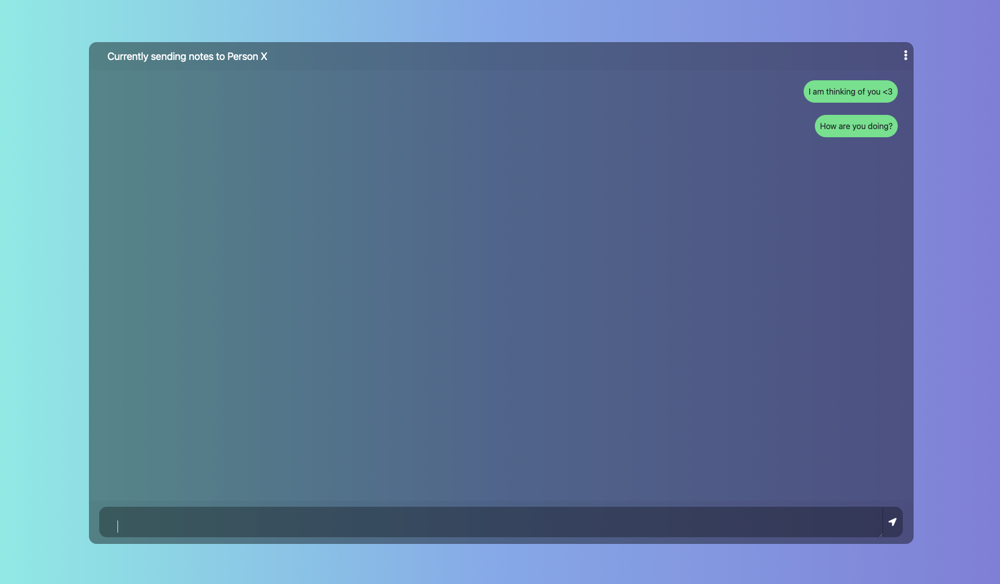

DIY Lovebox
===
DIY project for a lovebox inspired by https://en.lovebox.love/. After seeing a
commercial for this on Snapchat I decided to put my engineering (I'm lying, it's 'only' a CS degree)
to good use. The plan was to build two, because everyone knows that the economics
of scale make things cheaper. (They are not.) So I embarked on a journey of many
sleepless nights, and countless burned electrical bits and pieces.

Major props go to [Lisa](https://github.com/julisa99/Lovebox)! Following her
guide, I was able to skip a lot of headaches, but since she is located
in Germany, finding the same parts turned out to be a hassle. This in turn resulted in
me buying things I did not know how to use and wanting to go to a pub. BUT since we
are in a pandemic I can't do that, so I decided to just go to bed.

It's currently a work in progress but I will update the repo as I go.

<!---  -->

## Parts
1. [The box with lid](https://www.amazon.com/dp/B07KRPW5JZ)
2. [Arduino Nano 33 IoT](https://www.amazon.com/dp/B07VW9TSKD)
3. [Motor](https://www.amazon.com/dp/B078MSFFH5)
4. [Light sensor (Photoresistor)](https://www.amazon.com/dp/B07PF3CWW9) I bought this part at a electronics store
5. [10kΩ resistor](https://www.amazon.com/dp/B0185FIOTA) I bought this part at a electronics store
6. [OLED display](https://www.amazon.com/dp/B07FHLFQWB)
7. [Perfboard](https://www.amazon.com/dp/B072Z7Y19F) I bought this part at a electronics store
8. [Breakaway PCB Connector]() I bought this part at a electronics store
9. [1mm acryl]() (I got a mirror and that was a mistake, so tba)
10. [Darkening foil/dazzle strip]() (Haven't gotten this far yet)
13. [Wooden heart](https://www.amazon.com/dp/B01LXT1GX2)
14. [2N2222 Transistor](https://www.amazon.com/dp/B06XPWS52G)

## Hardware
The next part I took from [Lisa's](https://github.com/julisa99/Lovebox) repo because I pretty much did exactly what she did with the difference that I adjusted this to the Arduino nano's pin layout. I will post a picture to this below Lisa's pictures. Again, I am just expanding on her project so the next part is all from her. One note, however, is that I soldered together the 5V out on the Arduino and put a transistor between the 5V out and the motor to give it more power to get the red heart spinning.
> Below you can see where the OLED display, the light sensor with resistor and the servo motor are connected to the WeMos D1 Mini. The second photo is the soldered assembly. As you can see the micro-USB connector of the microcotroller board is at the ground. On top of the microcontroller a perfboard is soldered. Now the servo motor is added and also soldered to the perfboard. Notice the resistor and the light sensor that are also soldered to the board, with the light sensor pointing up. The display is soldered to another perfboard. The board provides a flat surface to hold the display in place. It is put on the motor and is connected to the other perfboard by using a Breakaway PCB Connector. It serves as a spacer to hold the other board above the motor.
 

This is my breadboard implementation and what the finished core looks like: 

After finishing the electronics, you have to drill into the case for the power cord and the motor mount. Then you need to cut the acrylic top but I ma not that far yet.

The last step is to try and put everything together. This is partly where I am still getting stuck :D.

## Software

I used the [Arduino IDE](https://www.arduino.cc/en/Main/Software) to program the Arduino.
Since it's the IoT version, it is wifi enabled but unfortunately does not have codable long term memory (EEPROM).
This turned out to be a problem when I tried making an app that could set the wifi password via bluetooth.
So who ever you are giving this too needs to give you their WiFi password.
A lot of the libraries can be installed via the Arduino IDE's library manager.

The way it works is that it checks the PubNub server for any new messages. If it finds one,
it will turn the heart until the lid is opened, which is when it starts to display the message.
After closing the lid, the screen clears and it waits to read the next message.
It also sends a read receipt back to PubNub so in a later version I can add check marks to the webpage.

The webpage is quite simple. It looks a lot like a generic messenger website. I will add a way
to manually change the PubNub keys and channel and maybe add support for multiple devices using a side bar.

This is a picture of the chat page.

## Final thoughts

Just buy the real thing. You won't be able to make this as good as the real thing
and will very likely spend more money on it then if you just buy it. But if you
still think you can do it, then please feel free to reach out if you have any questions
and good luck!

Also again, this was all possible because of [Lisa's](https://github.com/julisa99/Lovebox) amazing guide.
Check it out because it's wayyy better than mine! (Not even kidding)

###### tags: `Lovebox` `Instruction` `IoT`
